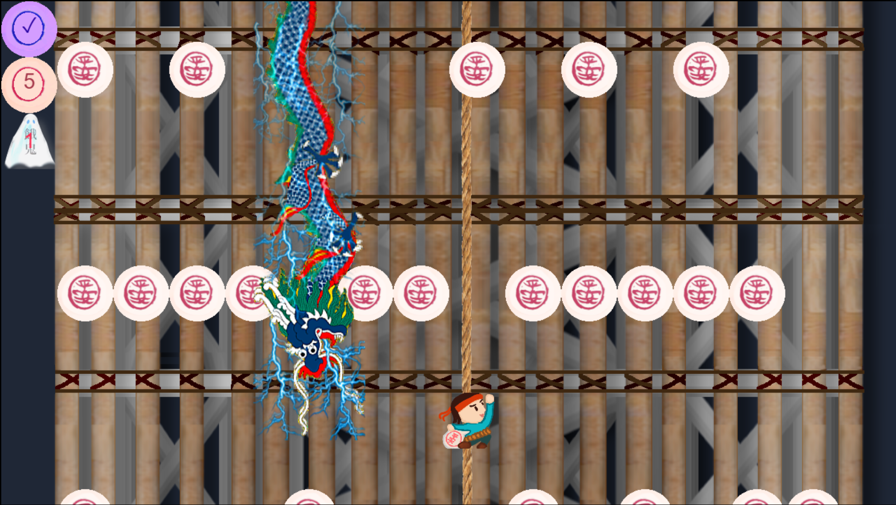

# Manjuu Mountain / 饅頭の山（PCゲーム）

このゲームのゴールは、できるだけたくさんの饅頭を集めて、新しい高さの記録を更新することです。

#### 【操作方法】
* **W**: 上の饅頭を集める
* **A**: 左の饅頭を集める
* **S**: 下の饅頭を集める
* **D**: 右の饅頭を集める
* **E**: 饅頭を5個消費して、自分の足元に**足場（プラットフォーム）**を設置する（より遠くへ進むために役立ちます！）
* **← ↑ →**: 移動する

龍と飢えた幽霊を避けながら、高みを目指しましょう！

## Preview

## Demo
試しに遊んでみてね: [https://manjuu-mountain.pages.dev/](https://manjuu-mountain.pages.dev/)
